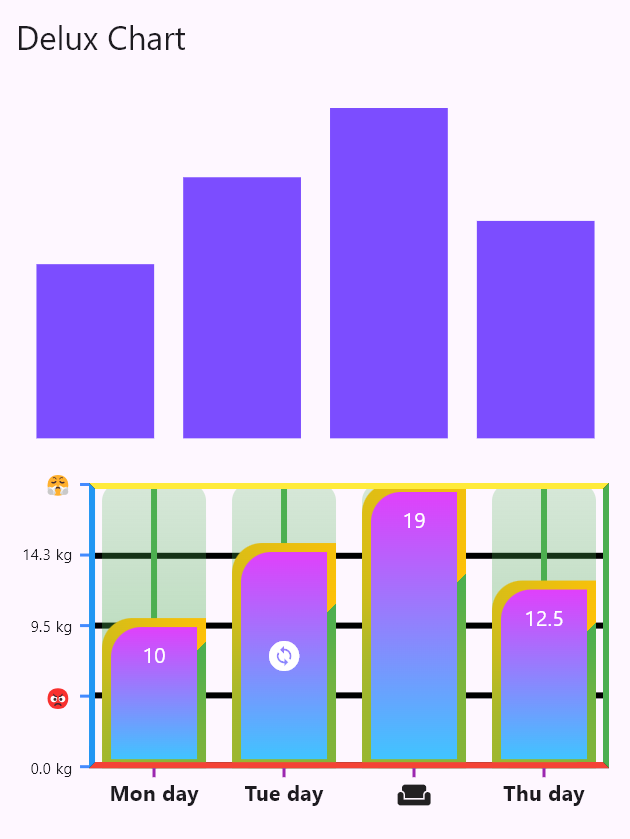

Customize Chart Widget based on Decoration Widget. Not Using paint, but only basic Material Widget.

## Features

Only Bar for now



## Usage

Wrap chart widget using widget size.

```dart
const AspectRatio(
  aspectRatio: 16 / 9,
  child: DeluxBarChart(
    data: [
      ChartData('Mon', 10),
      ChartData('Tue', 15),
      ChartData('Wed', 19),
      ChartData('Thu', 12.5),
    ],
  ),
),
```

## Additional information

More Info? https://www.youtube.com/@flutterdelux
